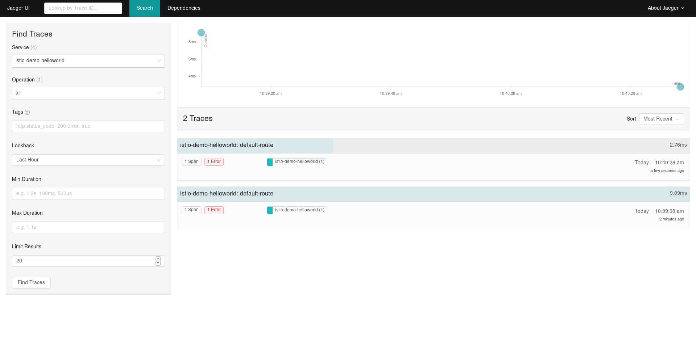
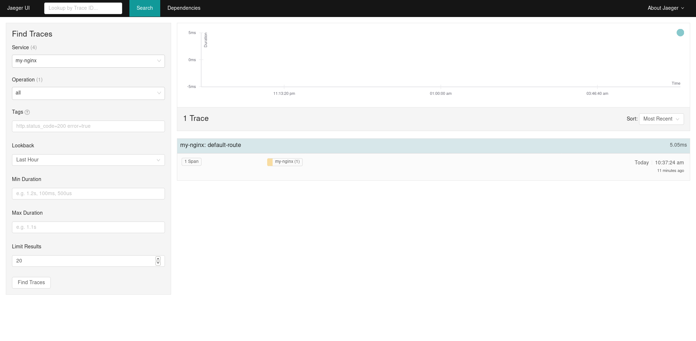
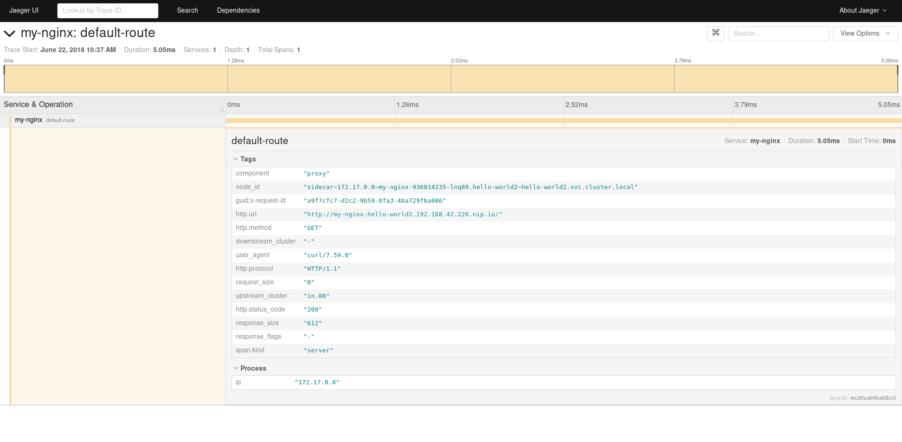

# Istio-Helloworld

## Build

Simply run:
```bash
./build.sh
```

## Getting traces from Istio

To get OpenTracing spans reported by Istio for inbound and outbound connections to this Hello World service, we need
an environment with:

* Kubernetes
* Istio
* Jaeger

For that, we'll use `minishift` following the [Red Hat Developer Demos' Istio Tutorial][istio-tutorial]. The instructions
assume a host running Fedora 28. Adapt and/or refer to the `istio-tutorial` for a more diverse set of hosts.

First, let's get an OpenShift cluster running:
```bash
minishift profile set istio-tutorial
minishift config set memory 8GB
minishift config set cpus 3
minishift config set vm-driver kvm
minishift config set image-caching true
minishift addon enable admin-user

minishift start

eval $(minishift oc-env)
eval $(minishift docker-env)
oc login $(minishift ip):8443 -u admin -p admin
```

Download and install Istio and Jaeger:

```bash
cd /tmp/
curl -L https://github.com/istio/istio/releases/download/0.6.0/istio-0.6.0-linux.tar.gz | tar xz
cd istio-0.6.0
export ISTIO_HOME=`pwd`
export PATH=$ISTIO_HOME/bin:$PATH

oc login $(minishift ip):8443 -u admin -p admin
oc adm policy add-scc-to-user anyuid -z istio-ingress-service-account -n istio-system
oc adm policy add-scc-to-user anyuid -z default -n istio-system
oc create -f install/kubernetes/istio.yaml
oc project istio-system
oc expose svc istio-ingress
oc expose svc prometheus
oc process -f https://raw.githubusercontent.com/jaegertracing/jaeger-openshift/master/all-in-one/jaeger-all-in-one-template.yml | oc create -f -
```

At this point, wait for the pods to be ready:

```bash
oc get pods -w
```

Create a new namespace for our hello-world project:

```bash
oc new-project hello-world
oc adm policy add-scc-to-user privileged -z default -n hello-world
```

Build the project and install it on the cluster:

```bash
./build.sh
oc apply -f <(istioctl kube-inject -f helloworld.yaml)
oc apply -f <(istioctl kube-inject -f my-nginx.yaml)

oc expose service istio-demo-helloworld
oc expose service my-nginx
```

Run `oc get route` and you should get something like:
```
$ oc get route
NAME                    HOST/PORT                                                  PATH      SERVICES                PORT      TERMINATION   WILDCARD
istio-demo-helloworld   istio-demo-helloworld-hello-world2.192.168.42.226.nip.io             istio-demo-helloworld   http                    None
my-nginx                my-nginx-hello-world2.192.168.42.226.nip.io                          my-nginx                http                    None
```

Run `oc get pods` and you should get something like:
```
$ oc get pods
NAME                                     READY     STATUS    RESTARTS   AGE
istio-demo-helloworld-1808862847-fzmd8   2/2       Running   0          1m
my-nginx-936814235-lnq89                 2/2       Running   0          4m
```

[istio-tutorial]: https://github.com/redhat-developer-demos/istio-tutorial


### Outcomes

The following screenshots show the expected outcome




